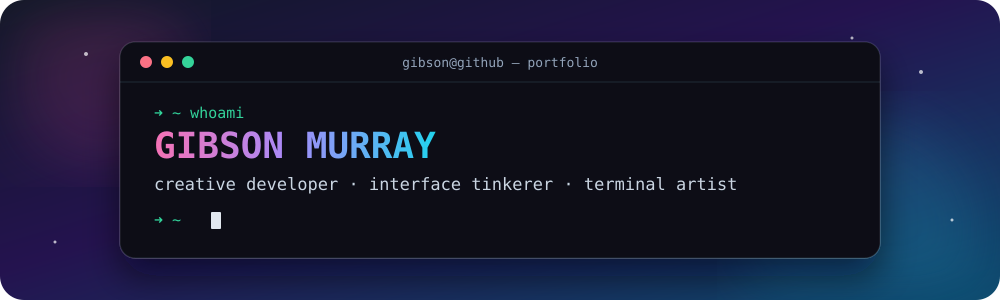

<div align="center">



<br />

[](https://gibsonmurray.com)
[](https://www.linkedin.com/in/gibsonmurray)
[](https://codepen.io/gibsonmurray)

`DESIGNING` · `BUILDING` · `ANIMATING` · `EXPERIMENTING`

</div>

---

### `~/welcome`

```text
┌──────────────────────────────────────────────────────────────────┐
│  Hey, I'm Gibson.                                                │
│  I build playful interfaces, useful developer tools, and         │
│  tiny digital worlds that make computers feel a little magical. │
└──────────────────────────────────────────────────────────────────┘
```

I’m a front-end developer drawn to the space where **code, motion, and visual design** overlap. Lately, that means expressive web experiences and a growing collection of terminal animations written in C.

> **Current quest:** make software with personality.

<table>
  <tr>
    <td width="33%" align="center">
      <strong>🎨 craft</strong><br />
      Interfaces with a point of view
    </td>
    <td width="33%" align="center">
      <strong>⚡ motion</strong><br />
      Interaction that feels alive
    </td>
    <td width="33%" align="center">
      <strong>🧪 play</strong><br />
      Experiments worth clicking
    </td>
  </tr>
</table>

---

### `~/featured-worlds`

<table>
  <tr>
    <td width="50%" valign="top">
      <h3>🌌 <a href="https://github.com/gibsonmurray/cgalaxy">cgalaxy</a></h3>
      <p>A colorful, procedurally generated spiral galaxy that lives in your terminal.</p>
      <p><code>C</code> <code>procedural art</code> <code>terminal</code></p>
    </td>
    <td width="50%" valign="top">
      <h3>✨ <a href="https://github.com/gibsonmurray/cfirefly">cfirefly</a></h3>
      <p>Ambient pulsing fireflies for quiet terminal sessions and late-night builds.</p>
      <p><code>C</code> <code>animation</code> <code>ambient</code></p>
    </td>
  </tr>
  <tr>
    <td width="50%" valign="top">
      <h3>🌀 <a href="https://github.com/gibsonmurray/cquasar">cquasar</a></h3>
      <p>A terminal particle accretion disk: cosmic motion rendered one character at a time.</p>
      <p><code>C</code> <code>particles</code> <code>generative</code></p>
    </td>
    <td width="50%" valign="top">
      <h3>🌊 <a href="https://github.com/gibsonmurray/ctidepool">ctidepool</a></h3>
      <p>Animated interference waves that turn your command line into a digital tide pool.</p>
      <p><code>C</code> <code>waves</code> <code>creative coding</code></p>
    </td>
  </tr>
</table>

<div align="center">

[](https://github.com/gibsonmurray/cidle)

</div>

---

### `~/command-palette`

<details>
<summary><strong>⌘ K &nbsp; Open my toolbox</strong></summary>
<br />

<div align="center">


</div>

</details>

<details>
<summary><strong>⌘ P &nbsp; Peek behind the pixels</strong></summary>
<br />

```js
const gibson = {
  focus: ["front-end", "creative coding", "developer tools"],
  currentlyExploring: ["terminal graphics", "motion", "delightful UX"],
  offline: ["gaming", "lifting", "collecting new side quests"],
  philosophy: "useful can still be weird, beautiful, and fun"
};
```

</details>

<details>
<summary><strong>⌘ G &nbsp; Load live GitHub telemetry</strong></summary>
<br />

<div align="center">
  <picture>
    <source media="(prefers-color-scheme: dark)" srcset="https://github-profile-summary-cards.vercel.app/api/cards/stats?username=gibsonmurray&theme=github_dark" />
    <source media="(prefers-color-scheme: light)" srcset="https://github-profile-summary-cards.vercel.app/api/cards/stats?username=gibsonmurray&theme=default" />
    
  </picture>
  <picture>
    <source media="(prefers-color-scheme: dark)" srcset="https://github-profile-summary-cards.vercel.app/api/cards/repos-per-language?username=gibsonmurray&theme=github_dark" />
    <source media="(prefers-color-scheme: light)" srcset="https://github-profile-summary-cards.vercel.app/api/cards/repos-per-language?username=gibsonmurray&theme=default" />
    
  </picture>
</div>

</details>

---

<div align="center">

### You made it to the footer.

There is no newsletter. There are no cookies. Just good vibes and source code.

[**← explore the repos**](https://github.com/gibsonmurray?tab=repositories) · [**say hello →**](https://www.linkedin.com/in/gibsonmurray)

<sub>Built with Markdown, unreasonable attention to detail, and zero JavaScript.</sub>

</div>
